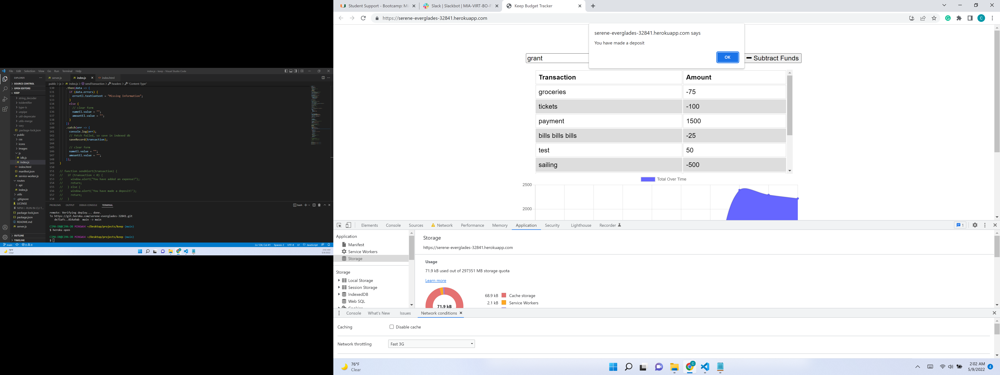

# [keep](https://dictionary.cambridge.org/us/dictionary/english/keep)
## [Visit Keep Budget Tracker](https://serene-everglades-32841.herokuapp.com/)
>keep noun (TOWER)
[ C ]   ARCHITECTURE   specialized
the strong main tower of a castle

>
## Overview
An online and offline asset tracker, keep it!

## Contents
  * [Overview](#overview),
  * [Table of Contents](#contents),
  * [Description](#description),
  * [Installation](#installation),
  * [Notes](#notes),
  * [Usage](#usage),
  * [Credits](#credits),
  * [License](#license),
  * [Badges](#badges),
  * [Features](#features),
  * [Contribute](#contribute),
  * [Tests](#tests)

## Description
  * Considering the need to keep things, our MVP begins with helping the user keep a budget.
  * Especially when traveling, budgets are hard to maintain.  Being able to visualize your cash flow can help you stay on track.
  * Furthermore, the ability to continue to keep tabs on spending while off the beaten path without internet service helps the remote worker or traveler.
  * The best aspect of the code presented is that it is set up to expand into several different "keeps".
 

## Installation
  * This is a deployed app, there are no special instructions required for its use!

## Usage

Criteria from the Module 19 Challenge:
>GIVEN a budget tracker without an internet connection
WHEN the user inputs an expense or deposit
THEN they will receive a notification that they have added an expense or deposit
WHEN the user reestablishes an internet connection
THEN the deposits or expenses added while they were offline are added to their transaction history and their totals are updated
>

  * 

  * [GitHub Repo](https://github.com/ChristiLewis/keep)

    ## Credits
  * [UM Coding Bootcamp](https://bootcamp.miami.edu/coding/)
  * [ChristiLewis](https://github.com/ChristiLewis)

## License
* Contents are credited as inspired by the bootcamp, API documentation licensing requirements, and as per permission by the team members mentioned above. All content by the UM Bootcamp has a MIT License.

## Badges
* There are no badges generated at this time. For more information: [shields.io](https://shields.io/)

## Features
* Realtime, anywhere interactions
* Offline input stored and synced once back online in Realtime.

## How-to-Contribute
* Any recommendations?  Please see [contributorCovenant](https://www.contributor-covenant.org)

## Tests
* There are no tests at this time, we are open to suggestions.
  
